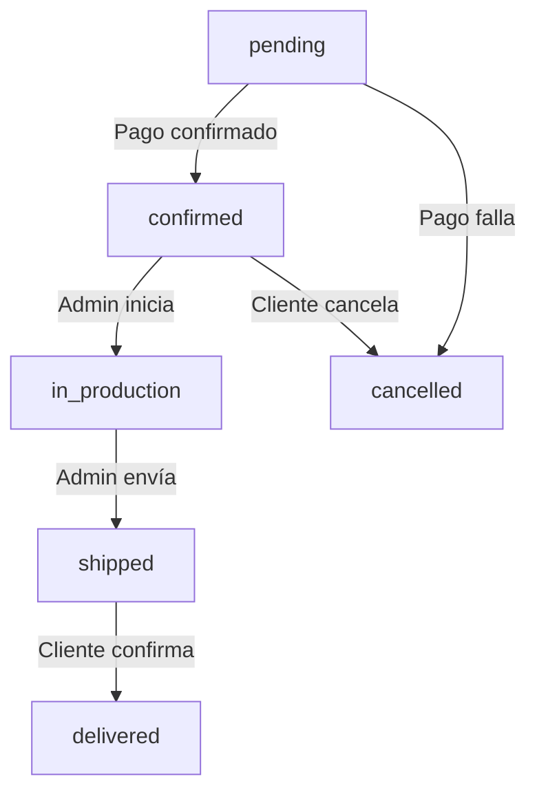

# Skill: E-commerce Flow Specialist

## Propósito
Esta habilidad guía al agente en la gestión completa del flujo de compra en Kamaluso, desde el carrito hasta la confirmación del pedido, incluyendo validación de cupones, cálculo de precios, gestión de métodos de envío y procesamiento de pagos con Mercado Pago.

## Arquitectura del Flujo de Compra

### 1. Carrito de Compras
- **Almacenamiento**: `localStorage` del navegador (persistencia entre sesiones)
- **Componente**: `components/Cart.tsx`
- **Estructura**:
```typescript
interface CartItem {
  productId: string;
  name: string;
  basePrice: number;
  quantity: number;
  personalization?: {
    [groupName: string]: string; // ej: { "Color": "Rojo", "Tapa": "Dura" }
  };
  additionalPrice: number; // Suma de personalizaciones
  totalPrice: number; // (basePrice + additionalPrice) * quantity
}
```

### 2. Proceso de Checkout
**Flujo Completo**:
```
[Carrito] → [Datos del Cliente] → [Método de Envío] → [Cupón] → [Método de Pago] → [Confirmación] → [Página de Éxito]
```

**Página Principal**: `pages/checkout.tsx`

#### Paso 1: Datos del Cliente
Campos requeridos:
- Nombre completo
- Email
- Teléfono
- Cédula (validación tipo DNI uruguayo)

#### Paso 2: Método de Envío
Opciones disponibles (definidas en backend):
- **DAC**: $250 (San José de Mayo)
- **Correo Uruguayo**: $350 (Todo Uruguay)
- **COTMI**: $300 (Montevideo y Canelones)
- **Retiro en local**: $0

**API**: `GET /api/shipping-methods` (devuelve lista dinámica)

#### Paso 3: Aplicación de Cupones
**API**: `POST /api/coupons/validate`
```typescript
// Request
{ code: "VERANO2026" }

// Response
{
  valid: true,
  coupon: {
    code: "VERANO2026",
    discountType: "percentage" | "fixed",
    discountValue: 15, // 15% o $15
    minPurchase: 1000,
    validUntil: "2026-02-28"
  }
}
```

**Validaciones**:
- Cupón existe y está activo
- No ha expirado (`validUntil >= hoy`)
- Cumple monto mínimo (`subtotal >= minPurchase`)
- No excede límite de usos (`usageCount < maxUses`)

#### Paso 4: Método de Pago
Opciones:
- **Mercado Pago** (tarjeta de crédito/débito)
- **Transferencia Bancaria** (requiere confirmación manual)

### 3. Integración con Mercado Pago

**SDK**: `mercadopago` npm package
**Configuración**: `MERCADOPAGO_ACCESS_TOKEN` en `.env.local`

**Flujo**:
1. Usuario selecciona "Mercado Pago"
2. Frontend llama a `POST /api/checkout/create-preference`
3. Backend crea preferencia con items del carrito
4. Mercado Pago devuelve `init_point` (URL de checkout)
5. Usuario es redirigido a Mercado Pago
6. Tras pago exitoso → webhook notifica a `/api/webhooks/mercadopago`
7. Backend actualiza estado del pedido
8. Usuario es redirigido a `/order-success?orderId=XXX`

**API de Creación de Preferencia**:
```typescript
// pages/api/checkout/create-preference.ts
import { MercadoPagoConfig, Preference } from 'mercadopago';

const preference = await client.preference.create({
  body: {
    items: cartItems.map(item => ({
      title: item.name,
      quantity: item.quantity,
      unit_price: item.totalPrice,
      currency_id: 'UYU'
    })),
    back_urls: {
      success: `${process.env.NEXT_PUBLIC_BASE_URL}/order-success`,
      failure: `${process.env.NEXT_PUBLIC_BASE_URL}/checkout?error=payment`,
      pending: `${process.env.NEXT_PUBLIC_BASE_URL}/order-pending`
    },
    notification_url: `${process.env.NEXT_PUBLIC_BASE_URL}/api/webhooks/mercadopago`,
    external_reference: orderId
  }
});
```

### 4. Modelo de Pedido (Order)

**Modelo**: `models/Order.ts` (a crear si no existe)
```typescript
interface IOrder {
  orderNumber: string; // Autogenerado: "KML-20260129-001"
  customer: {
    name: string;
    email: string;
    phone: string;
    cedula: string;
  };
  items: CartItem[];
  subtotal: number;
  shippingCost: number;
  discount: number; // Del cupón
  total: number;
  shippingMethod: string;
  paymentMethod: 'mercadopago' | 'transferencia';
  paymentStatus: 'pending' | 'paid' | 'failed' | 'refunded';
  orderStatus: 'pending' | 'confirmed' | 'in_production' | 'shipped' | 'delivered' | 'cancelled';
  couponUsed?: string;
  mercadoPagoId?: string; // ID de pago de MP
  notes?: string;
  createdAt: Date;
  updatedAt: Date;
}
```

### 5. Webhooks de Mercado Pago

**API**: `pages/api/webhooks/mercadopago.ts`

**Eventos Importantes**:
- `payment.created`: Pago iniciado
- `payment.updated`: Cambio en estado del pago

**Validación de Seguridad**:
```typescript
// Verificar que el webhook viene de Mercado Pago
const signature = req.headers['x-signature'];
// Validar con secret de MP (ver docs oficiales)
```

**Acciones según Estado**:
- `approved`: Marcar pedido como `paid` → Enviar email de confirmación
- `pending`: Mantener en `pending`
- `rejected`: Marcar como `failed` → Notificar al cliente

## Cálculo de Precios

### Fórmula Completa:
```typescript
const itemPrice = (basePrice + additionalPersonalizationPrice) * quantity;
const subtotal = cartItems.reduce((sum, item) => sum + item.totalPrice, 0);
const shipping = getShippingCost(selectedMethod);
const discount = calculateDiscount(subtotal, coupon);
const total = subtotal + shipping - discount;
```

### Validaciones Críticas:
1. **Precio del producto**: Siempre obtener de la base de datos, NUNCA confiar en el frontend
2. **Precio de personalización**: Validar contra `Product.customizationGroups[].options[].price`
3. **Stock**: Verificar disponibilidad antes de confirmar

## Email Notifications

**Servicio**: Nodemailer (próximamente Resend)
**Ubicación**: `lib/nodemailer.ts`

**Emails a Enviar**:
1. **Confirmación de Pedido**: Tras pago exitoso
   - Resumen del pedido
   - Número de orden
   - Tiempo estimado de producción
   - Link de seguimiento (futuro)

2. **Actualización de Estado**: Cambios en `orderStatus`
   - "En producción"
   - "Enviado" (incluir tracking)
   - "Entregado"

**Template**:
```typescript
const emailHtml = `
  <h2>¡Gracias por tu pedido, ${customerName}!</h2>
  <p>Tu pedido <strong>${orderNumber}</strong> ha sido confirmado.</p>
  <h3>Resumen:</h3>
  <ul>
    ${items.map(item => `<li>${item.name} x${item.quantity} - $${item.totalPrice}</li>`).join('')}
  </ul>
  <p><strong>Total: $${total}</strong></p>
  <p>Lo produciremos en los próximos 5 días hábiles.</p>
`;
```

## Panel de Administración de Pedidos

**Página**: `pages/admin/orders.tsx`

**Funcionalidades**:
- Listar todos los pedidos (con filtros por estado, fecha)
- Ver detalle del pedido
- Actualizar estado del pedido
- Marcar como "En producción" / "Enviado"
- Generar PDF del pedido (para impresión interna)
- Buscar por número de orden o email de cliente

**API**: `pages/api/admin/orders/` (CRUD endpoints)

## Estados del Pedido y Flujo



## Mejores Prácticas

### 1. Validación en Backend
**NUNCA** confiar en datos del frontend para cálculos de precio:
```typescript
// ❌ MAL
const total = req.body.total; // Puede ser manipulado

// ✅ BIEN
const products = await Product.find({ _id: { $in: itemIds } });
const calculatedTotal = calculateTotalSafely(products, items);
```

### 2. Atomicidad de Transacciones
Usar transacciones de MongoDB para operaciones críticas:
```typescript
const session = await mongoose.startSession();
session.startTransaction();
try {
  await Order.create([orderData], { session });
  await Coupon.updateOne({ code }, { $inc: { usageCount: 1 } }, { session });
  await session.commitTransaction();
} catch (error) {
  await session.abortTransaction();
  throw error;
} finally {
  session.endSession();
}
```

### 3. Logging de Pagos
Registrar TODOS los eventos de pago:
```typescript
console.log(`[MP Webhook] Payment ${paymentId} - Status: ${status} - Order: ${orderId}`);
// Considerar usar un sistema de logs más robusto (Winston, Pino)
```

### 4. Manejo de Errores con Usuario
Mensajes claros y útiles:
```typescript
// ❌ MAL
throw new Error("Error en el pago");

// ✅ BIEN
throw new Error("No pudimos procesar tu pago. Por favor, verificá los datos de tu tarjeta o intentá con otro método.");
```

## Testing del Flujo

### Ambiente de Sandbox de Mercado Pago:
```env
MERCADOPAGO_ACCESS_TOKEN=TEST-xxxxx  # Token de prueba
```

**Tarjetas de Prueba**: https://www.mercadopago.com.uy/developers/es/guides/resources/test-cards

### Casos a Probar:
- [ ] Compra exitosa con Mercado Pago
- [ ] Pago rechazado (tarjeta inválida)
- [ ] Aplicación de cupón válido
- [ ] Rechazo de cupón inválido o expirado
- [ ] Cálculo correcto de envío
- [ ] Email de confirmación enviado
- [ ] Actualización de estado en admin

## Recursos Relacionados
- [Modelo de Producto](file:///c:/Users/LENOVO/Desktop/kamaluso_fullstack/models/Product.ts)
- [Modelo de Cupón](file:///c:/Users/LENOVO/Desktop/kamaluso_fullstack/models/Coupon.ts)
- [Componente de Carrito](file:///c:/Users/LENOVO/Desktop/kamaluso_fullstack/components/Cart.tsx)
- [Docs de Mercado Pago](https://www.mercadopago.com.uy/developers/es/docs)

## Checklist para Nuevas Funcionalidades de E-commerce

- [ ] ¿Los precios se calculan en el backend?
- [ ] ¿Hay validación de stock?
- [ ] ¿Se manejan correctamente los errores de pago?
- [ ] ¿Se envía email de confirmación?
- [ ] ¿El estado del pedido se actualiza correctamente?
- [ ] ¿Se registra el uso del cupón?
- [ ] ¿Hay logs de auditoría para transacciones?
- [ ] ¿Se probó en sandbox antes de producción?
